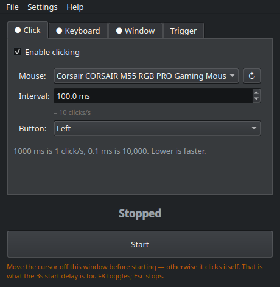

# WayClick

**An autoclicker that actually works on Wayland.**

[Português (BR)](README.pt-BR.md) · [Install](#install) · [Usage](#using-it) · [How it works](#how-it-works)

Instead of fighting the compositor, WayClick creates a **virtual mouse in the
kernel** through `/dev/uinput`, so its clicks arrive the same way your real
mouse's clicks do — no X11, no `xdotool`, no compositor extensions, nothing
running as root.

<p align="center">
  
</p>

- **1 click/s down to a 0.1 ms interval** — 10,000 clicks/s, measured at 100%
  delivery on the receiving window
- **Global hotkey** that works even when the window is not focused
- **Hold mode** — clicks only while you physically hold the mouse button
- **Keyboard macro** — any key, captured the way shortcuts are set; repeat or hold
- **Send key to a window** — pick an open window and feed it a key; for X11
  targets it arrives with no focus change, even minimized
- **Anti-AFK** — nudges the pointer and puts it back, with zero drift
- **Tray icon** in four shapes and eight colors, pulsing while it works and
  flashing when you start it; autostart, your system color schemes, English and
  Portuguese

---

## Requirements

| | |
|---|---|
| Desktop | KDE Plasma on Wayland |
| Python | 3.9 or newer |
| Qt bindings | PySide6 (`QtMultimedia` optional — only for the beeps) |
| Permissions | your user in the `input` group, and `/dev/uinput` writable by it |

## Install

### Packages

Grab one from [the latest release](https://github.com/gabrielmf1998/WayClick/releases/latest):

| | |
|---|---|
| **Fedora, RHEL** | `sudo dnf install ./wayclick-*.noarch.rpm` |
| **Debian, Ubuntu** | `sudo apt install ./wayclick_*_all.deb` |
| **Arch, Manjaro** | `sudo pacman -U ./wayclick-*-any.pkg.tar.zst` |
| **Anything else** | `chmod +x WayClick-*.AppImage && ./WayClick-*.AppImage` |

The packages ship the udev rule, so all that is left is joining the `input`
group once: `sudo usermod -aG input $USER`, then log out and back in. The
AppImage carries its own Python and Qt and needs no dependencies at all — only
the hotkey beeps are missing there, since PySide6-Essentials leaves out
QtMultimedia; it falls back to `paplay` from your system.

### One command

```bash
curl -fsSL https://raw.githubusercontent.com/gabrielmf1998/WayClick/main/install.sh | bash
```

It detects your distro, installs PySide6, sets up the `uinput` module and its
udev rule, adds you to the `input` group, and drops the app into `~/.local`
with a menu entry. Everything that needs `sudo` is announced before it runs.
Then just run `wayclick`, or find **WayClick** in your application menu.

> Piping a script into `bash` means trusting it. Read it first if you like:
> [`install.sh`](install.sh).

### By hand

Same four steps on every distro; only the package name changes.

**1. Install PySide6**

```bash
sudo pacman -S pyside6                                   # Arch, Manjaro
sudo dnf install python3-pyside6                         # Fedora
sudo apt install python3-pyside6.qtwidgets \
                 python3-pyside6.qtmultimedia            # Debian, Ubuntu
pip install --user PySide6                               # anything else
```

**2. Make sure the `uinput` module is loaded, now and at boot**

```bash
sudo modprobe uinput
echo uinput | sudo tee /etc/modules-load.d/uinput.conf
```

**3. Let the `input` group use `/dev/uinput`**

On several distros the device is created as `root:root`, so group membership
alone is not enough:

```bash
sudo tee /etc/udev/rules.d/99-wayclick-uinput.rules <<'EOF'
KERNEL=="uinput", SUBSYSTEM=="misc", MODE="0660", GROUP="input", OPTIONS+="static_node=uinput"
EOF
sudo udevadm control --reload-rules && sudo udevadm trigger --name-match=uinput
```

**4. Join the `input` group**

```bash
sudo usermod -aG input $USER
```

Group changes only apply to **new** sessions. Log out and back in — or start it
anyway: WayClick notices the mismatch and relaunches itself through `sg input`,
which works immediately and asks for no password.

**Run it**

```bash
git clone https://github.com/gabrielmf1998/WayClick.git
cd WayClick
python3 wayclick.py
```

## Using it

```bash
wayclick            # normal
wayclick --tray     # start hidden in the system tray
wayclick --version
```

Four tabs: **Click**, **Keyboard** and **Window** are the three things it can
run — each has an *enable* box, and the tab shows a dot when it is on, so you
can see what is armed without opening it. Enable any combination. **Trigger** is
how it all starts and stops, plus Anti-AFK, which runs on its own outside
Start/Stop. Status and the Start button stay visible below the tabs, and the
window is small enough for a 1366×768 screen.

The menu bar has the rest: **File** starts, stops, hides to tray and quits;
**Settings** holds **Theme** and **Language** (English, Português BR) plus the
sound and autostart toggles; **Help** links here and shows the version. Both
preferences are saved. The language defaults to your locale, so a Brazilian
system opens in Portuguese with no setup.

**Tray icon** has its own submenu: the **shape** (cursor, mouse, dot or ring)
and the **color** — one of seven fixed colors, or *Match state*, which keeps the
default grey stopped, blue armed, green clicking. The icon pulses while running
and plays a short expanding ring the moment you start or stop, which is the
feedback you want when triggering by hotkey with the window hidden.

**Theme** reads the color schemes installed on your system
(`/usr/share/color-schemes/*.colors`), so "Breeze Dark" here is the real Breeze
Dark, not an approximation — any scheme you install shows up in the menu. Two
built-in schemes cover systems that ship none, and *System* hands the styling
back to your desktop.

### Click

**Mouse** — pick which mouse to use. Every mouse the system exposes is listed;
`↻` rescans after plugging one in. This matters more than it looks: the virtual
device is created as a *clone* of the mouse you pick (same name, vendor and
product id), which is how KDE applies **your** pointer speed and acceleration
profile to it. Without that, the pointer falls back to system defaults and feels
wrong the moment hold mode takes over.

**Interval** — time between clicks, from 1000 ms down to 0.1 ms, with the
clicks/s equivalent shown below it. Lower is faster.

**Button** — left, right or middle.

### Keyboard macro

Presses a key through a second virtual device, a real keyboard as far as the
kernel is concerned. To choose the **key** you click the field and press the
key you want, the way you would set a shortcut — no list to hunt through, and
any key on your keyboard works. Then pick the **action**: `Repeat` taps it at
the interval you set, `Hold` presses it once and keeps it down. The key is
always released on stop, on quit, and if the process dies — it never stays
stuck.

One thing to expect in `Hold`: holding a normal key makes the system's own key
repeat kick in, exactly as if you held it on your keyboard. Modifiers (Shift,
Ctrl, Alt, Super) do not repeat, so they stay cleanly held.

### Trigger

**Mode**

- `Hotkey toggles` — press the hotkey to start, press again to stop.
- `Clicks while hotkey is held` — runs only while the key stays down.
- `Clicks while mouse button is held` — arm it, then it runs only while you
  physically hold the mouse button. Release and it stops, still armed.

**Start delay** — seconds before it begins. Move the cursor off the window
first, otherwise the autoclicker clicks its own Stop button.

**Auto-stop after** — stops on its own after N seconds (`never` = off).

**Global hotkey** — F6–F12, Insert, Pause, ScrollLock or numpad +/−. Works from
any window. `Esc` always stops when the window is focused.

**Sound feedback** — a short high beep when it starts, low when it stops, so you
know the hotkey registered without looking.

### Send key to a window

Pick one of your open windows and WayClick feeds it a key on an interval —
Space into a game every 60 s, for instance, while you keep working. The list
shows every open window with its real icon and a marker for how the key will
get there, and the key is set by pressing it, same as in the macro:

| | |
|---|---|
| **⌨** | X11 window (Xwayland). The key is addressed to that window: your focus is never touched, and it works **even minimized**. |
| **◐** | Pure Wayland window. There is no way to address it, so WayClick focuses it for ~40 ms, sends the key and hands focus back. |

Measured against an X11 target running in its own process, with focus parked on
another window the whole time: 3 of 3 delivered while unfocused, 6 more while
minimized, 0 leaked into the focused window.

If the window you picked is pure Wayland, the group shows a red notice. The way
out is to reopen that program as an X11 client, which usually takes one
environment variable:

```bash
SDL_VIDEODRIVER=x11 ./game          # SDL (most games)
GDK_BACKEND=x11 ./app               # GTK
QT_QPA_PLATFORM=xcb ./app           # Qt
flatpak run --env=SDL_VIDEODRIVER=x11 org.example.App
```

Then it shows up as ⌨ and takes the key directly. Two honest caveats: an app
that reads raw input may ignore synthetic X11 events, and this is keyboard
only — clicks follow the cursor rather than focus, so aiming them at a window
would mean warping your pointer.

### Anti-AFK

Nudges the pointer a few pixels and puts it right back, every N seconds. It is
independent of Start/Stop — tick it and it runs, even while nothing is clicking,
which is the point: games and sites usually decide you are idle from **pointer
movement**, not from clicks, so an autoclicker alone can still get you kicked
for being AFK.

Two details make it behave. The two moves are 50 ms apart, because sent together
the compositor would fold +4 and −4 into the same frame and nothing would appear
to move at all. And the direction flips every cycle: pointer acceleration scales
the outbound and return moves by slightly different factors, so they do not
cancel on their own, and without flipping the cursor would crawl across the
screen — measured at 0.15 px per cycle, hundreds of pixels an hour. Alternating
pins it between two positions instead: **0.0000 px of drift**.

The step is 4 device units rather than 1 because acceleration shrinks it: on a
slowed-down pointer, 1 unit came out as 0.402 px on screen — not even a whole
pixel, which an app reading integer coordinates would never notice. 4 units land
around 2–3 px, enough to register anywhere and still invisible, since it returns
in 50 ms.

## How it works

Wayland deliberately has no "send a click to that window" API, so WayClick works
one layer below the compositor.

**Clicking** — `/dev/uinput` creates a real input device in the kernel. libinput
picks it up, the compositor treats it as hardware, and clicks land wherever your
cursor is. To reach 10,000 clicks/s the press/SYN/release/SYN sequence goes out
in a single `write()`, and the loop uses an absolute deadline: it sleeps for the
bulk of the interval and busy-waits the last ~100 µs, because OS sleep
granularity alone cannot hit sub-millisecond timing.

**Global hotkey** — reads `/dev/input/event*` directly, the only way to see keys
that are not focused on your window. Keyboards created by remappers (keyd,
kmonad, input-remapper) count as valid sources.

**Per-window key** — Wayland gives input to whoever has focus and offers no way
to address a surface; KWin's `fake_input`, the only injection protocol it
implements, has no surface argument either. X11 is the opposite: `XSendEvent`
carries a destination window and the client handles it while unfocused and
unmapped, which is why the ⌨ path works and the ◐ one has to borrow focus.
WayClick reads the window list from KWin scripting (the only thing that sees
Wayland windows) and the X11 ids straight from `_NET_CLIENT_LIST` through
libX11.

**Hold mode** — this one needs a trick. The compositor tracks button state per
*seat*, so while your physical button is held it **discards every click you
inject** — measured: 0 out of 20 delivered. So WayClick takes an `EVIOCGRAB` on
the mouse you selected, meaning the compositor no longer sees the real device,
and relays everything through the virtual one — motion, wheel, other buttons —
filtering out only the trigger button, which becomes the click stream. Relay
latency measured at 0.02 ms median under a 10,000 clicks/s load, so the pointer
stays smooth. The grab is released on stop, on quit, and by the kernel if the
process dies.

## Troubleshooting

**"Global hotkey OFF"** — you are not in the `input` group, or the session
predates the group change. Follow steps 3 and 4 above, then log out and back in.

**`/dev/uinput` permission denied** — the udev rule in step 3 is missing, or the
`uinput` module is not loaded (step 2). Check with `ls -l /dev/uinput`.

**Clicking does nothing / it turns itself off** — the cursor was over WayClick's
own window when it started. That is what the start delay is for.

**Web pages freeze at very high rates** — not the injection: browsers process
input on a single JS thread and cannot keep up with 10,000 events/s. On the web,
1–5 ms (200–1000 clicks/s) is the useful ceiling. Native apps take far more.

**Sensitivity feels different in hold mode** — make sure the mouse selected in
the UI is the one you are actually holding; the clone copies that device's
identity, and that is what KDE keys its per-device settings on.

**Kicked for being AFK even though it was clicking** — idle detection usually
watches pointer movement, not clicks. Turn on Anti-AFK. Some games go further
and check whether your character moved, in which case use the keyboard macro to
press a movement key too.

## Tests

The files in `tests/` are runnable checks, not unit tests — they create fake
input devices and measure real behaviour. Run them from the project root:

```bash
sg input -c "python3 tests/t_hold.py"        # hold mode end to end, with a fake mouse
sg input -c "python3 tests/t_clone.py"       # asks KWin over D-Bus if the clone inherited your settings
sg input -c "python3 tests/t_hotkey.py"      # global hotkey, with a fake keyboard
sg input -c "python3 tests/t_relay_lat.py"   # relay latency under a 10 kHz click load
sg input -c "python3 tests/t_multimouse.py"  # several mice, each cloned with its own identity
python3 tests/t_fast.py 0.1                  # emitted vs. delivered clicks at 10,000/s
python3 tests/t_keymacro.py                  # keys delivered, and never left stuck
python3 tests/t_antiafk.py                   # nudge amplitude on screen and drift over time
sg input -c "python3 tests/t_xinject.py"     # key into an X11 window, unfocused then minimized
sg input -c "python3 tests/t_target.py"      # same for a Wayland target, through the focus path
sg input -c "python3 tests/t_holdtime.py"    # press duration, measured the way a game polls it
```

They open a fullscreen window to count what actually arrives, so expect the
screen to flash for a few seconds. Each test uses its own throwaway config, so
none of them touch your settings.

## Translating

Translations are a plain dict in `wayclick.py` — no `.ts` files, no build step,
because the app is a single file. To add a language, copy the `"pt_BR"` block in
`TRANSLATIONS`, change the key to your locale prefix, translate the right-hand
side, and add it to `LANGS`. Anything you leave out falls back to English, so a
partial translation still works. Strings with `{name}` placeholders keep them.

## Notes

Settings live in `~/.config/wayclick.json`. Nothing runs as root, nothing is
installed system-wide except the udev rule, and the virtual devices disappear
when the process exits.

Use it where automation is allowed. Plenty of online games ban input automation.

## Building the packages

```bash
bash packaging/build-rpm.sh        # needs rpm-build
bash packaging/build-deb.sh        # needs only ar and tar, no dpkg
bash packaging/build-pacman.sh     # needs bsdtar, builds off Arch too
bash packaging/build-appimage.sh   # downloads a portable Python and Qt
makepkg -p packaging/PKGBUILD      # the from-source route, on Arch
```

Everything lands in `dist/`. A tag push builds all of them on CI and attaches
them to the release — see [`.github/workflows/release.yml`](.github/workflows/release.yml).

## Uninstall

```bash
bash uninstall.sh            # keeps your settings and the udev rule
bash uninstall.sh --purge    # removes those too
```

For a packaged install use your package manager instead (`dnf remove wayclick`,
`apt remove wayclick`, `pacman -R wayclick`).

## License

MIT — see [LICENSE](LICENSE).
