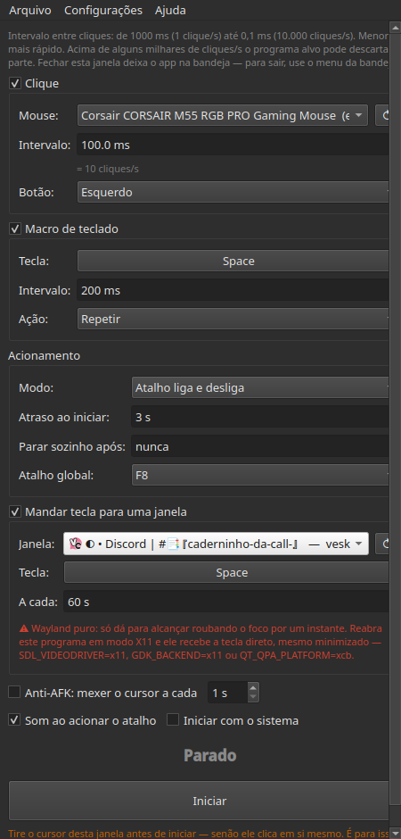
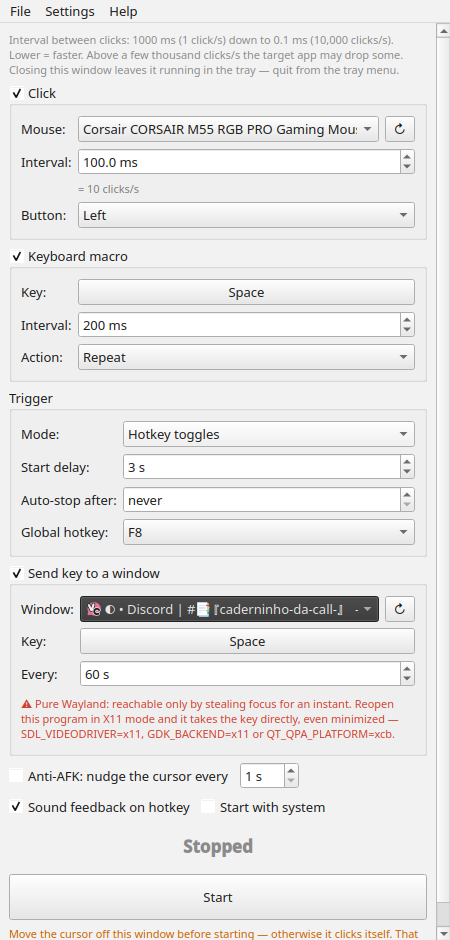

# WayClick

**Um autoclicker que funciona de verdade no Wayland.**

[English](README.md) · [Instalação](#instalação) · [Como usar](#como-usar) · [Como funciona](#como-funciona)

Em vez de brigar com o compositor, o WayClick cria um **mouse virtual no
kernel** através do `/dev/uinput`. Os cliques dele chegam pelo mesmo caminho dos
cliques do seu mouse de verdade — sem X11, sem `xdotool`, sem extensão de
compositor e sem nada rodando como root.

<p align="center">
  
  
</p>

- **De 1 clique/s até 0,1 ms de intervalo** — 10.000 cliques/s, medidos com 100%
  de entrega na janela que recebe
- **Atalho global** que funciona mesmo com a janela fora de foco
- **Modo segurar** — só clica enquanto você segura o botão do mouse
- **Macro de teclado** — qualquer tecla, capturada como se define um atalho; repetindo ou segurando
- **Mandar tecla para uma janela** — escolha uma janela aberta e alimente ela
  com uma tecla; em alvo X11 chega sem mexer no foco, mesmo minimizada
- **Anti-AFK** — mexe o ponteiro e devolve, com deriva zero
- **Ícone na bandeja** em quatro formatos e dez cores, pulsando enquanto
  trabalha e piscando ao ligar; iniciar com o sistema, os esquemas de cor do
  seu sistema, inglês e português

---

## Requisitos

| | |
|---|---|
| Ambiente | KDE Plasma no Wayland |
| Python | 3.9 ou mais novo |
| Bindings Qt | PySide6 (`QtMultimedia` é opcional — só para os bipes) |
| Permissões | seu usuário no grupo `input`, e `/dev/uinput` gravável por ele |

## Instalação

### Pacotes

Pegue um na [release mais recente](https://github.com/gabrielmf1998/WayClick/releases/latest):

| | |
|---|---|
| **Fedora, RHEL** | `sudo dnf install ./wayclick-*.noarch.rpm` |
| **Debian, Ubuntu** | `sudo apt install ./wayclick_*_all.deb` |
| **Arch, Manjaro** | `sudo pacman -U ./wayclick-*-any.pkg.tar.zst` |
| **Qualquer outra** | `chmod +x WayClick-*.AppImage && ./WayClick-*.AppImage` |

Os pacotes já trazem a regra de udev, então só falta entrar uma vez no grupo
`input`: `sudo usermod -aG input $USER`, e sair e entrar de novo. O AppImage
carrega o próprio Python e Qt e não precisa de dependência nenhuma — só os
bipes do atalho ficam de fora, porque o PySide6-Essentials não inclui o
QtMultimedia; ele cai no `paplay` do seu sistema.

### Um comando

```bash
curl -fsSL https://raw.githubusercontent.com/gabrielmf1998/WayClick/main/install.sh | bash
```

Ele detecta sua distro, instala o PySide6, prepara o módulo `uinput` e a regra
de udev, adiciona você ao grupo `input` e coloca o app em `~/.local` com entrada
no menu. Tudo que precisa de `sudo` é anunciado antes de rodar. Depois é só
executar `wayclick` ou procurar **WayClick** no menu de aplicativos.

> Jogar um script direto no `bash` é um voto de confiança. Leia antes se
> preferir: [`install.sh`](install.sh).

### Na mão

São os mesmos quatro passos em qualquer distro; só muda o nome do pacote.

**1. Instale o PySide6**

```bash
sudo pacman -S pyside6                                   # Arch, Manjaro
sudo dnf install python3-pyside6                         # Fedora
sudo apt install python3-pyside6.qtwidgets \
                 python3-pyside6.qtmultimedia            # Debian, Ubuntu
pip install --user PySide6                               # qualquer outra
```

**2. Garanta o módulo `uinput` carregado, agora e no boot**

```bash
sudo modprobe uinput
echo uinput | sudo tee /etc/modules-load.d/uinput.conf
```

**3. Deixe o grupo `input` usar o `/dev/uinput`**

Em várias distros o device nasce como `root:root`, então estar no grupo não
basta:

```bash
sudo tee /etc/udev/rules.d/99-wayclick-uinput.rules <<'EOF'
KERNEL=="uinput", SUBSYSTEM=="misc", MODE="0660", GROUP="input", OPTIONS+="static_node=uinput"
EOF
sudo udevadm control --reload-rules && sudo udevadm trigger --name-match=uinput
```

**4. Entre no grupo `input`**

```bash
sudo usermod -aG input $USER
```

Mudança de grupo só vale para sessões **novas**. Saia e entre de novo — ou abra
assim mesmo: o WayClick percebe a diferença e se reexecuta via `sg input`, que
funciona na hora e não pede senha.

**Rodando**

```bash
git clone https://github.com/gabrielmf1998/WayClick.git
cd WayClick
python3 wayclick.py
```

## Como usar

```bash
wayclick            # normal
wayclick --tray     # começa escondido na bandeja
wayclick --version
```

São quatro abas: **Clique**, **Teclado** e **Janela** são as três coisas que ele
pode executar — cada uma tem sua caixa de habilitar, e a aba ganha um ponto
quando está ligada, então dá para ver o que está armado sem abrir. Habilite
qualquer combinação. **Acionamento** é como tudo liga e desliga, mais o
Anti-AFK, que roda por fora do Iniciar/Parar. O status e o botão Iniciar ficam
sempre visíveis abaixo das abas, e a janela cabe numa tela de 1366×768.

O resto está na barra de menus: **Arquivo** inicia, para, esconde na bandeja e
sai; **Configurações** tem **Tema** e **Idioma** (English, Português BR), além
dos toggles de som e de iniciar com o sistema; **Ajuda** leva ao projeto e
mostra a versão. As duas preferências ficam salvas. O idioma vem do locale do
sistema, então uma máquina brasileira já abre em português sem configurar nada.

O **Ícone da bandeja** tem submenu próprio: o **formato** (cursor, mouse, ponto
ou anel) e a **cor** — uma das nove fixas, incluindo branco e preto, ou
*Conforme o estado*, que mantém o padrão cinza parado, azul armado, verde
clicando. O contorno alterna entre escuro e claro conforme o preenchimento,
então branco e preto continuam visíveis em qualquer painel. O glifo pulsa
enquanto roda, e ligar ou desligar faz ele saltar de pequeno para o tamanho
cheio atrás de um anel que cresce e some — o retorno que faltava quando se
aciona pelo atalho com a janela escondida.

O **Tema** lê os esquemas de cor instalados no seu sistema
(`/usr/share/color-schemes/*.colors`), então o "Breeze Dark" aqui é o Breeze
Dark de verdade, não uma aproximação — qualquer esquema que você instalar
aparece no menu. Dois esquemas embutidos cobrem quem não tem nenhum, e o
*Sistema* devolve a aparência para o seu ambiente.

### Clique

**Mouse** — escolha qual mouse usar. Todos os que o sistema expõe aparecem na
lista, e o `↻` reprocura depois de plugar um. Isso importa mais do que parece: o
device virtual é criado como um *clone* do mouse escolhido (mesmo nome, vendor e
product id), e é assim que o KDE aplica **a sua** velocidade e perfil de
aceleração nele. Sem clonar, o ponteiro cai no padrão do sistema e a
sensibilidade fica estranha assim que o modo segurar assume.

**Intervalo** — tempo entre cliques, de 1000 ms até 0,1 ms, com o equivalente em
cliques/s logo abaixo. Menor é mais rápido.

**Botão** — esquerdo, direito ou meio.

### Macro de teclado

Aperta uma tecla por um segundo device virtual, um teclado de verdade do ponto
de vista do kernel. Para escolher a **tecla** você clica no campo e aperta a
tecla que quiser, do jeito que se define um atalho — sem lista para caçar, e
qualquer tecla do teclado serve. Depois escolha a **ação**: `Repetir` bate no
intervalo definido, `Segurar` aperta uma vez e mantém pressionada. A tecla é
sempre solta ao parar, ao sair e mesmo se o processo morrer — nunca fica presa.

Uma coisa esperada no `Segurar`: manter uma tecla normal pressionada aciona a
repetição automática do próprio sistema, igualzinho a segurar no teclado.
Modificadores (Shift, Ctrl, Alt, Super) não repetem, então ficam limpos.

### Acionamento

**Modo**

- `Atalho liga e desliga` — aperta para começar, aperta de novo para parar.
- `Age enquanto o atalho é segurado` — roda só enquanto a tecla estiver
  pressionada.
- `Age enquanto o botão do mouse é segurado` — arme, e ele roda só enquanto você
  segurar fisicamente o botão. Ao soltar, para, mas continua armado.

**Atraso ao iniciar** — segundos antes de começar. Tire o cursor da janela
primeiro, senão o autoclicker clica no próprio botão Parar.

**Parar sozinho após** — para depois de N segundos (`nunca` = desligado).

**Atalho global** — F6–F12, Insert, Pause, ScrollLock ou +/− do numérico.
Funciona de qualquer janela. `Esc` sempre para, com a janela em foco.

**Som ao acionar** — um bipe agudo ao ligar e grave ao desligar, para você saber
que o atalho pegou sem precisar olhar.

### Mandar tecla para uma janela

Escolha uma das suas janelas abertas e o WayClick alimenta ela com uma tecla no
intervalo definido — espaço num jogo a cada 60 s, por exemplo, enquanto você
continua trabalhando. A lista mostra cada janela aberta com o ícone real do
programa e uma marca de como a tecla vai chegar; a tecla se define apertando
ela, igual na macro:

| | |
|---|---|
| **⌨** | Janela X11 (Xwayland). A tecla é endereçada àquela janela: seu foco nunca é tocado, e funciona **mesmo minimizada**. |
| **◐** | Janela Wayland pura. Não há como endereçar, então o WayClick dá foco a ela por ~40 ms, manda a tecla e devolve o foco. |

Medido contra um alvo X11 em processo próprio, com o foco parado em outra janela
o tempo todo: 3 de 3 entregues sem foco, mais 6 com a janela minimizada, 0
vazaram para a janela em foco.

Se a janela escolhida for Wayland pura, o grupo mostra um aviso vermelho. A saída
é reabrir aquele programa como cliente X11, o que normalmente é uma variável de
ambiente:

```bash
SDL_VIDEODRIVER=x11 ./jogo          # SDL (a maioria dos jogos)
GDK_BACKEND=x11 ./app               # GTK
QT_QPA_PLATFORM=xcb ./app           # Qt
flatpak run --env=SDL_VIDEODRIVER=x11 org.exemplo.App
```

Aí ele passa a aparecer como ⌨ e recebe a tecla direto. Dois poréns honestos:
programa que lê input raw pode ignorar evento sintético do X11, e isto vale só
para teclado — clique segue o cursor, não o foco, então mirar clique numa janela
exigiria teleportar seu ponteiro.

### Anti-AFK

Mexe o ponteiro alguns pixels e devolve para onde estava, a cada N segundos. É
independente do Iniciar/Parar — marque e ele roda, mesmo sem nada clicando, que
é justamente a graça: jogos e sites decidem que você está ocioso pelo
**movimento do ponteiro**, não pelos cliques, então só o autoclick ainda deixa
você tomar kick por AFK.

Dois detalhes fazem funcionar. Os dois movimentos vão separados por 50 ms,
porque mandados juntos o compositor somaria +4 e −4 no mesmo quadro e nada
pareceria ter se mexido. E o sentido inverte a cada ciclo: a aceleração do
ponteiro escala a ida e a volta com fatores um pouco diferentes, então elas não
se anulam sozinhas, e sem inverter o cursor iria andando pela tela — medido em
0,15 px por ciclo, centenas de pixels por hora. Alternando, ele fica preso entre
duas posições: **0,0000 px de deriva**.

O passo é de 4 unidades e não 1 porque a aceleração encolhe o deslocamento: com
o ponteiro desacelerado, 1 unidade virou 0,402 px de tela — nem um pixel
inteiro, o que um programa que lê coordenadas inteiras nunca perceberia. 4
unidades dão uns 2–3 px, o bastante para registrar em qualquer configuração e
ainda invisível, já que volta em 50 ms.

## Como funciona

O Wayland não tem, de propósito, uma API de "mande um clique naquela janela".
Então o WayClick age uma camada abaixo do compositor.

**Clicar** — o `/dev/uinput` cria um dispositivo de entrada de verdade no
kernel. O libinput reconhece, o compositor trata como hardware, e os cliques
caem onde o cursor estiver. Para chegar a 10.000 cliques/s, a sequência
press/SYN/release/SYN sai em um único `write()`, e o laço usa deadline absoluto:
dorme o grosso do intervalo e queima os últimos ~100 µs em busy-wait, porque a
granularidade do sleep do sistema sozinha não alcança precisão de
sub-milissegundo.

**Atalho global** — lê `/dev/input/event*` direto, único jeito de enxergar
teclas que não estão indo para a sua janela. Teclados criados por remapeadores
(keyd, kmonad, input-remapper) valem como fonte.

**Tecla por janela** — o Wayland entrega input para quem tem foco e não oferece
como endereçar uma surface; o `fake_input` do KWin, único protocolo de injeção
que ele implementa, também não tem argumento de surface. O X11 é o oposto: o
`XSendEvent` carrega a janela de destino e o cliente processa mesmo sem foco e
sem estar mapeado — por isso o caminho ⌨ funciona e o ◐ precisa pedir foco
emprestado. O WayClick lê a lista de janelas pelo scripting do KWin (única coisa
que enxerga janela Wayland) e os ids X11 direto do `_NET_CLIENT_LIST` via libX11.

**Modo segurar** — esse precisa de um truque. O compositor agrega o estado dos
botões por *seat*, então enquanto o botão físico está pressionado ele
**descarta todo clique injetado** — medido: 0 de 20 entregues. Por isso o
WayClick dá um `EVIOCGRAB` no mouse escolhido: o compositor deixa de ver o
device real e passa a ver só o virtual, e nós repassamos tudo — movimento, roda,
outros botões — filtrando apenas o botão-gatilho, que vira o fluxo de cliques. A
latência do relay ficou em 0,02 ms de mediana sob carga de 10.000 cliques/s,
então o ponteiro continua liso. A captura é liberada ao parar, ao sair, e pelo
kernel se o processo morrer.

O gatilho só é engolido quando o clique está ligado, que é quando o autoclicker
reemite no lugar dele. Segure o botão para acionar só a macro de teclado e ele é
repassado normalmente — você fica com o seu botão e com a macro.

## Problemas comuns

**"Atalho global DESLIGADO"** — você não está no grupo `input`, ou a sessão
começou antes da mudança de grupo. Faça os passos 3 e 4 acima e saia/entre de
novo.

**Permissão negada em `/dev/uinput`** — falta a regra de udev do passo 3, ou o
módulo `uinput` não está carregado (passo 2). Confira com `ls -l /dev/uinput`.

**Clica e não acontece nada / desliga sozinho** — o cursor estava em cima da
janela do WayClick quando começou. É para isso que serve o atraso ao iniciar.

**Sites travam em taxas muito altas** — não é a injeção: navegador processa
entrada numa única thread de JS e não dá conta de 10.000 eventos/s. Na web, de
1 a 5 ms (200 a 1000 cliques/s) é o teto útil. Programas nativos aguentam muito
mais.

**A sensibilidade muda no modo segurar** — confira se o mouse selecionado na
interface é o que você está segurando de fato; o clone copia a identidade
daquele device, e é nela que o KDE guarda as configurações por dispositivo.

**Tomei kick de AFK mesmo com o clique rodando** — detecção de ociosidade
costuma olhar movimento do ponteiro, não cliques. Ligue o Anti-AFK. Alguns jogos
vão além e checam se o personagem se moveu; nesse caso use também a macro de
teclado apertando uma tecla de movimento.

## Testes

Os arquivos em `tests/` são verificações executáveis, não testes unitários —
eles criam dispositivos de entrada falsos e medem comportamento real. Rode a
partir da raiz do projeto:

```bash
sg input -c "python3 tests/t_hold.py"        # modo segurar de ponta a ponta, com mouse falso
sg input -c "python3 tests/t_hold_keyonly.py"  # modo segurar acionando só a macro de teclado
sg input -c "python3 tests/t_clone.py"       # pergunta ao KWin via D-Bus se o clone herdou sua config
sg input -c "python3 tests/t_hotkey.py"      # atalho global, com teclado falso
sg input -c "python3 tests/t_relay_lat.py"   # latência do relay sob carga de 10 kHz
sg input -c "python3 tests/t_multimouse.py"  # vários mouses, cada um clonado com sua identidade
python3 tests/t_fast.py 0.1                  # cliques emitidos x entregues a 10.000/s
python3 tests/t_keymacro.py                  # teclas entregues, e nunca deixadas presas
python3 tests/t_antiafk.py                   # amplitude do nudge na tela e deriva ao longo do tempo
sg input -c "python3 tests/t_xinject.py"     # tecla numa janela X11, sem foco e depois minimizada
sg input -c "python3 tests/t_target.py"      # o mesmo para alvo Wayland, pelo caminho do foco
sg input -c "python3 tests/t_holdtime.py"    # duração da tecla, medida como um jogo consulta
```

Eles abrem uma janela em tela cheia para contar o que realmente chega, então a
tela pisca por alguns segundos. Cada teste usa um config descartável próprio,
nenhum deles encosta nas suas configurações.

## Traduzindo

As traduções são um dicionário simples dentro do `wayclick.py` — sem arquivos
`.ts`, sem etapa de build, porque o app é um arquivo só. Para adicionar um
idioma, copie o bloco `"pt_BR"` em `TRANSLATIONS`, troque a chave pelo prefixo
do seu locale, traduza o lado direito e acrescente em `LANGS`. O que faltar cai
no inglês, então tradução parcial já funciona. Textos com `{nome}` mantêm os
marcadores.

## Observações

As configurações ficam em `~/.config/wayclick.json`. Nada roda como root, nada é
instalado no sistema além da regra de udev, e os devices virtuais somem quando o
processo termina.

Use onde automação for permitida. Muito jogo online bane automação de entrada.

## Construindo os pacotes

```bash
bash packaging/build-rpm.sh        # precisa de rpm-build
bash packaging/build-deb.sh        # só precisa de ar e tar, sem dpkg
bash packaging/build-pacman.sh     # precisa de bsdtar, constrói fora do Arch
bash packaging/build-appimage.sh   # baixa um Python e um Qt portáteis
makepkg -p packaging/PKGBUILD      # a via a partir do fonte, no Arch
```

Tudo cai em `dist/`. Um push de tag constrói os quatro no CI e anexa na
release — veja [`.github/workflows/release.yml`](.github/workflows/release.yml).

## Desinstalando

```bash
bash uninstall.sh            # mantém suas configurações e a regra de udev
bash uninstall.sh --purge    # remove essas também
```

Se instalou por pacote, use o gerenciador (`dnf remove wayclick`,
`apt remove wayclick`, `pacman -R wayclick`).

## Licença

MIT — veja [LICENSE](LICENSE).
